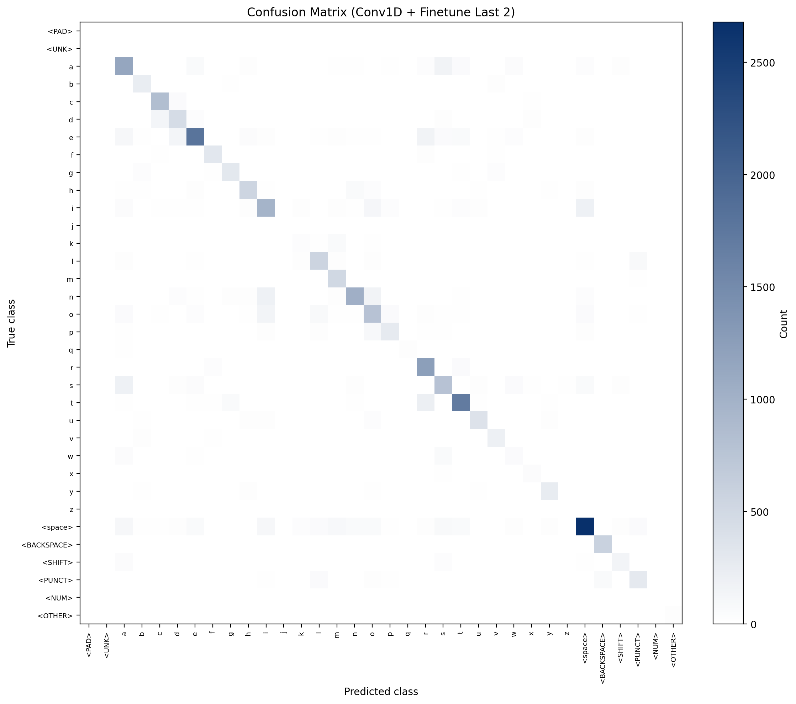

# Stage 1 Findings

This document summarizes the progression of Stage 1 experiments across the specified training/evaluation runs and what each run contributed to the final recipe.

## Executive Takeaways

- Best observed setup is `conv1d` + fine-tuning last 2 Chronos encoder blocks (`exp_stage1_conv1d_finetune_last2`).
- The first Conv1D test before `all_p` data (`train_20260411_151905_823333.log`) reached only `0.5013` top-1, while later Conv1D on `all_p` reached `0.6445` top-1.
- Relative to frozen-encoder `conv1d`, fine-tuning improved:
  - Top-1: `0.6444 -> 0.6961` (+5.17 points)
  - Macro F1: `0.5109 -> 0.5527` (+4.18 points)
  - Weighted F1: `0.6455 -> 0.6948` (+4.94 points)
  - Test loss: `1.1170 -> 0.9585`
- The largest gains came from (1) the Conv1D head over frozen Chronos tokens, (2) the `coarse_rare_all_p` export including a second participant, (3) regularization, and (4) fine-tuning the last two encoder blocks.

## Run-by-Run Results

> Notes on comparability:
>
> - `stage1_chronos/train.log` uses `stage1_export` with 71 classes.
> - `stage1_chronos_coarse32` and `exp_stage1_attention_pool` use coarse32 exports with 34 classes.
> - `exp_stage1_conv1d*` runs use `stage1_export_coarse_rare_all_p` with 34 classes and substantially larger sample count.
> - Metrics across different datasets/class spaces are directionally useful but not directly apples-to-apples.

| Run                                                                             | Data / classes         | Best epoch (val loss) | Test top1 | Test top3 | Test top5 | Eval micro/macro/weighted F1  |
| ------------------------------------------------------------------------------- | ---------------------- | --------------------- | --------- | --------- | --------- | ----------------------------- |
| `checkpoints/stage1_chronos/train.log`                                          | `stage1_export` / 71   | 24                    | 0.2532    | 0.4254    | 0.5557    | 0.2928 / 0.0774 / 0.2734      |
| `checkpoints/stage1_chronos_coarse32/train_20260410_132742_616908.log`          | coarse32 / 34          | 28                    | 0.2560    | 0.4387    | 0.5709    | N/A (no `eval_test` artifact) |
| `checkpoints/exp_stage1_attention_pool/train_20260411_145153_411755.log`        | coarse32 / 34          | 99                    | 0.3082    | 0.5127    | 0.6403    | 0.3082 / 0.1562 / 0.2858      |
| `checkpoints/exp_stage1_conv1d/train_20260411_151905_823333.log`                | pre-`all_p` coarse32 / 34 | 3                  | 0.5013    | 0.7583    | 0.8680    | N/A (no `eval_test` artifact) |
| `checkpoints/exp_stage1_conv1d/train_20260411_202339_548032.log`                | coarse_rare_all_p / 34 | 4                     | 0.6445    | 0.8875    | 0.9478    | 0.6444 / 0.5109 / 0.6455      |
| `checkpoints/exp_stage1_conv1d_regularized/train_20260411_213657_925906.log`    | coarse_rare_all_p / 34 | 6                     | 0.6559    | 0.8897    | 0.9504    | N/A (no `eval_test` artifact) |
| `checkpoints/exp_stage1_conv1d_finetune_last2/train_20260412_223048_089027.log` | coarse_rare_all_p / 34 | 3                     | 0.6961    | 0.9147    | 0.9620    | 0.6961 / 0.5527 / 0.6948      |

## What Went Right (and Why)

### 1) Baseline Chronos head proved viability, but remained class-imbalance limited

- In `stage1_chronos/train.log`, top-1 reached ~0.25 on 71 classes.
- `eval_test/per_class_f1.csv` shows strong concentration on common classes (`space`, `e`, `t`) and near-zero F1 for many low-support classes.
- This established feasibility but highlighted the need for label-space simplification and better token-level modeling.

### 2) Coarse32 formulation stabilized learning but still underfit with simple heads

- `stage1_chronos_coarse32` improved top-1 only modestly (~0.256 test top-1).
- `exp_stage1_attention_pool` improved further (top-1 ~0.308, macro F1 ~0.156), showing pooling across full `VxL` tokens helps.
- However, confusion remained high across many letter classes; per-class F1 stayed limited for rare keys.

### 3) Conv1D head (temporal CNN over encoder tokens)

- We adopted a Conv1D classifier on top of full pre-pool Chronos tokens `(B, V, L, D)` instead of only global pooling. It applies per-position projection, stacks variates into channels, and runs 1D convolutions over time before classification (`models/stage1_heads.py`).
- First Conv1D training run: `checkpoints/exp_stage1_conv1d/train_20260411_151905_823333.log`, config `configs/experiments/exp_conv1d.yaml`, coarse32 export (pre-`all_p` split sizes). Best checkpoint at epoch 3: test top-1 `0.5013`, test loss `1.7416`.
- On the same 34-class coarse label space, attention pooling (`exp_stage1_attention_pool`) reached test top-1 `0.3082`. The Conv1D head delivered a clear gain by using local temporal structure in the encoder sequence.
- Training still overfits if run too long: train loss drops while validation loss rises after the best epoch, so early stopping on validation loss is required.

### 4) Second participant in the dataset (`coarse_rare_all_p` / `all_p`)

- Export `stage1_export_coarse_rare_all_p` adds sessions from an additional participant compared to the earlier coarse32-only pipeline used for `train_20260411_151905_823333.log`.
- Split sizes for the earlier Conv1D run: train `n=27,310`, val `n=4,845`, test `n=9,168`. For Conv1D on `all_p`: train `n=88,543`, val `n=8,588`, test `n=26,034` (`train_20260411_202339_548032.log`).
- Same head and training recipe (`exp_conv1d.yaml`): test top-1 moves from `0.5013` to `0.6445`, test loss from `1.7416` to `1.1893`. Macro F1 on the held-out eval run is `0.5109` for the `all_p` model (`eval_test/metrics.json`).
- The extra participant and larger row counts improve generalization. Overfitting remains visible (train loss keeps falling after the best validation epoch). Plan for more participant diversity and stronger tail-class handling (regularization, sampling), not only model capacity.

### 5) Regularization helped hold generalization despite strong overfit pressure

- `exp_stage1_conv1d_regularized` increased dropout (`0.25`), stronger weight decay (`0.05`), lower LR (`1e-4`), larger batch (`64`), patience (`8`).
- Test improved to top-1 `0.6559` (from `0.6445`) and top-5 `0.9504`.
- No `eval_test` folder was present for this run, so classwise F1/confusion diagnostics are unavailable.

### 6) Fine-tuning the last 2 Chronos blocks delivered best overall performance

- `exp_stage1_conv1d_finetune_last2` (head LR `1e-4`, encoder LR `1e-5`) reached:
  - test top-1 `0.6961`
  - macro F1 `0.5527`
  - weighted F1 `0.6948`
- Largest per-class improvements are visible in medium/high-frequency classes (`r`, `m`, `o`, `h`, `g`, `f`, `v`, `y`) and stronger punctuation/backspace handling.
- Frozen Chronos embeddings were already strong; updating the last two encoder blocks plus the head closed the remaining gap versus head-only training on `all_p`.

## Class-Level Behavior (Best Run)

From `exp_stage1_conv1d_finetune_last2/eval_test/per_class_f1.csv`:

- Strong classes (high support + high F1): `space` (0.773), `t` (0.816), `c` (0.836), `backspace` (0.883), `r` (0.791).
- Improved but still moderate: `w` (0.231), `k` (0.225), `z` (0.232).
- Persistent failure mode: very low-support symbols, especially `j` (F1 `0.0`) and `<NUM>` aggregate class (F1 `0.025`).

Interpretation:

- The model separates core alphabetic and control keys reliably on the test split.
- Tail classes remain support-limited; next steps include class-aware sampling, harder negatives, or revisiting coarse buckets for rare symbols.

## Confusion Matrix (Best Method)

Best method: `exp_stage1_conv1d_finetune_last2`

Artifacts:

- Raw matrix: `checkpoints/exp_stage1_conv1d_finetune_last2/eval_test/confusion_matrix.csv`
- Summary metrics: `checkpoints/exp_stage1_conv1d_finetune_last2/eval_test/metrics.json`
